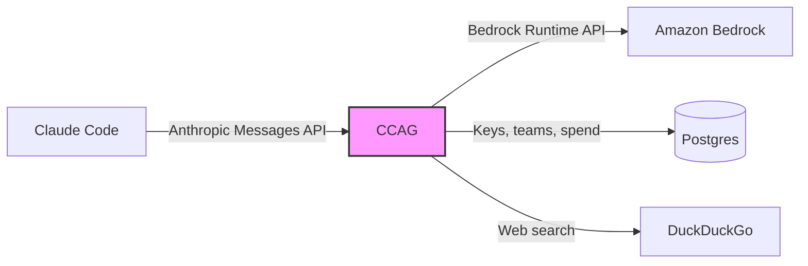
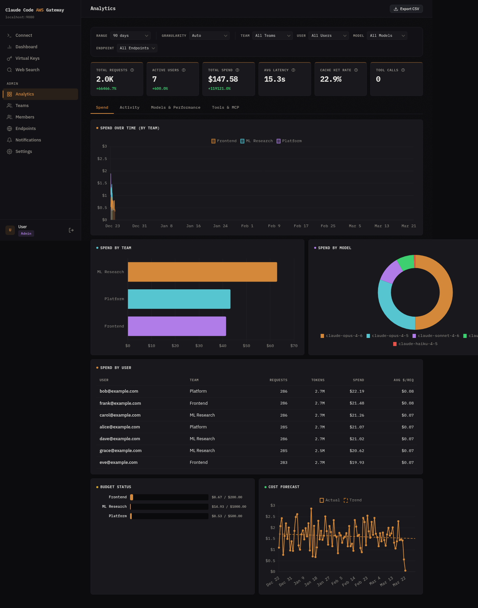
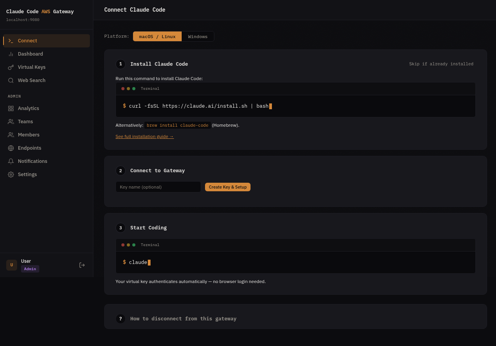

# Claude Code AWS Gateway (CCAG)

[](https://github.com/antkawam/claude-code-aws-gateway/actions)
[](https://github.com/antkawam/claude-code-aws-gateway/releases)
[](https://crates.io/crates/ccag-cli)
[](https://scorecard.dev/viewer/?uri=github.com/antkawam/claude-code-aws-gateway)
[](LICENSE)

A self-hosted API gateway that translates the Anthropic Messages API to Amazon Bedrock, enabling extended thinking and web search when using [Claude Code](https://docs.anthropic.com/en/docs/claude-code) with your own AWS account.

## Why CCAG?

When Claude Code connects to Bedrock directly (`CLAUDE_CODE_USE_BEDROCK=1`), it identifies as a Bedrock client. In this mode, extended thinking and web search are not available. CCAG provides these by presenting as the Anthropic Messages API while routing inference through your AWS account.

| | Direct Bedrock | Through CCAG |
|---|---|---|
| Extended thinking | No | Yes |
| Tool use | Partial | Yes |
| Web search | No | Yes (DuckDuckGo, Tavily, Serper, or custom per user) |
| Multi-account/region routing | N/A | Pool quota across accounts, regions, and teams |
| Multi-user management | N/A | Virtual API keys, teams, budgets, rate limiting |
| Developer onboarding | Manual config | One-command setup via portal Connect page |
| SSO authentication | N/A | OIDC with any provider (Okta, Azure AD, Google, etc.) |
| Admin portal | N/A | Built-in SPA for key management and analytics |

## Architecture



Claude Code connects to CCAG as it would to the Anthropic API. The gateway translates requests to Bedrock format, handles SSE streaming, and maps model IDs. No client-side changes are needed.

### Portal





## Getting Started

### Prerequisites

- AWS account with [Bedrock model access](https://docs.aws.amazon.com/bedrock/latest/userguide/model-access.html) enabled for Claude models
- AWS CLI configured with credentials
- Docker

### Option A: Docker Compose

Suitable for solo users, small teams, or evaluation.

```bash
cd claude-code-aws-gateway
cp .env.example .env
# Edit .env: set AWS_REGION and AWS credentials (AWS_PROFILE or access keys)
docker compose up -d
```

The gateway starts at `http://localhost:8080`. Log in at `http://localhost:8080/portal` with the default admin credentials (`admin`/`admin`) to create API keys and manage users.

If port 8080 is already in use: `GATEWAY_PORT=9080 docker compose up -d`
If port 5432 is already in use: `POSTGRES_PORT=5488 docker compose up -d`

### Option B: AWS CDK (ECS Fargate + RDS)

For teams that need managed infrastructure with load balancing, autoscaling, custom domains, and RDS Postgres.

```bash
cd infra && npm install
# See infra/README.md for the deployment guide
```

This creates a production stack: VPC, ALB, ECS Fargate (ARM64/Graviton), RDS Postgres, autoscaling, CloudWatch alarms, and optional Route53/TLS. See [`infra/README.md`](infra/README.md) for the deployment guide.

### Connect Claude Code

Log in to the admin portal at `http://localhost:8080/portal` and navigate to the **Connect** page. Developers get a single command that installs Claude Code (if needed), creates an API key, and configures the gateway connection — no manual env vars or config files.

```bash
curl -fsSL https://your-gateway/setup | sh   # one command, fully configured
```

## Features

### API Translation

- `/v1/messages` and `/v1/messages/count_tokens` endpoints
- SSE event stream translation (Bedrock binary stream to Anthropic SSE format)
- Automatic model ID mapping between Anthropic and Bedrock identifiers
- Beta flag allowlisting (filters flags that Bedrock does not accept)
- `cache_control` field passthrough for Bedrock
- Web search interception with per-user configurable providers (DuckDuckGo, Tavily, Serper, or custom)

### Multi-Endpoint Routing

- Route requests across multiple AWS accounts, regions, or inference profiles from a single gateway
- Assign endpoints to teams with per-team routing strategies (sticky user, primary/fallback, round robin)
- Cross-account access via STS AssumeRole with external ID support
- Automatic failover on 429/5xx with health tracking per endpoint
- Sticky user routing preserves prompt cache affinity across conversations

### Multi-User Management

- Virtual API keys: issue and revoke keys per user or team
- Teams: group users with shared budgets and rate limits
- Budgets: per-key and per-team spending limits with notification webhooks
- Rate limiting: per-key sliding window rate limiter
- Spend tracking: async batch writes to Postgres with per-key analytics

### Authentication

Three-tier authentication for different use cases:

1. Admin credentials: username/password for initial setup (`ADMIN_USERNAME`/`ADMIN_PASSWORD`)
2. Virtual API keys: database-backed keys for programmatic access
3. OIDC SSO: JWT validation with any compliant identity provider

Supported OIDC providers include Okta, Azure AD, Google Workspace, Auth0, Keycloak, and any provider with a `.well-known/openid-configuration` endpoint. Multiple providers can be active at the same time.

### Admin Portal

A built-in single-page application at `/portal` for:

- Key creation and management
- Team administration
- Identity provider configuration
- Gateway settings
- Analytics dashboard with 4 tabs:
  - Spend: timeseries by team, spend by team/model/user, budget status, OLS cost forecast
  - Activity: active users over time (new vs returning), hourly request heatmap
  - Models & Performance: model mix, latency percentiles (p50/p95/p99), cache hit rate, token breakdown, endpoint utilization
  - Tools & MCP: tool call totals, MCP server usage, top tools
- Multi-select filters (team, user, model, endpoint) with time range and granularity control
- CSV export of filtered analytics data

### Observability

- Prometheus metrics at `/metrics`
- Optional OTLP export via gRPC
- Structured logging with configurable log levels

## Configuration

CCAG is configured through environment variables:

| Variable | Default | Description |
|---|---|---|
| `PROXY_HOST` | `127.0.0.1` | Listen address |
| `PROXY_PORT` | `8080` | Listen port |
| `DATABASE_URL` | | Postgres connection URL (required) |
| `ADMIN_USERNAME` | `admin` | Bootstrap admin username |
| `ADMIN_PASSWORD` | `admin` | Bootstrap admin password |
| `ADMIN_USERS` | | Comma-separated OIDC subjects auto-provisioned as admin |
| `OIDC_ISSUER` | | OIDC issuer URL for SSO |
| `OIDC_AUDIENCE` | | Expected JWT audience claim |
| `OIDC_JWKS_URL` | | Override JWKS endpoint (auto-discovered from issuer by default) |
| `RUST_LOG` | `info` | Log level (`debug` for request body logging) |
| `OTEL_EXPORTER_OTLP_ENDPOINT` | | OTLP gRPC endpoint for metrics export |
| `BUDGET_NOTIFICATION_URL` | | Webhook URL or SNS topic ARN for budget alerts |

See [docs/configuration.md](docs/configuration.md) for the full reference including TLS, database, and notification settings.

### Model Routing

Bedrock model IDs are resolved automatically from the AWS SDK's configured region.

| AWS Region | Inference Profile |
|---|---|
| `us-*`, `ca-*` | US cross-region |
| `eu-*` | EU cross-region |
| `ap-southeast-2`, `ap-southeast-4` | Australia |
| `ap-*`, `me-*` | Asia Pacific |
| `us-gov-*` | GovCloud |

Custom model mappings can also be configured through the admin portal.

## Development

### Build and test

```bash
make build               # Build gateway + CLI
make test                # Unit tests
make lint                # Format check + clippy
make check               # All checks (what CI runs)
make test-integration    # Integration tests (requires Docker)
```

### Project structure

```
src/
  main.rs              Entry point, startup, cache poll loop
  api/
    handlers.rs        HTTP handlers (messages, count_tokens, health)
    admin.rs           Admin API (keys, teams, users, spend, IDPs, settings, analytics)
  config/mod.rs        GatewayConfig, routing prefix auto-detection
  proxy/mod.rs         Shared gateway state
  auth/
    mod.rs             In-memory key cache, key validation
    oidc.rs            Multi-IDP OIDC JWT validation, JWKS caching
  ratelimit/mod.rs     Per-key sliding window rate limiter
  db/                  Postgres pool, migrations, CRUD operations
    org_analytics.rs   Cross-org analytics queries (~20 functions)
  spend/mod.rs         Async spend tracker (buffer + flush loop)
  telemetry/mod.rs     Prometheus metrics, OTLP export
  translate/
    models.rs          Model ID mapping (Anthropic <-> Bedrock)
    request.rs         Request translation
    response.rs        Response normalization
    streaming.rs       SSE event formatting
  websearch/mod.rs     DuckDuckGo web search interception
static/index.html     Embedded admin portal SPA
infra/                 AWS CDK (TypeScript) for ECS Fargate + RDS
migrations/            Postgres schema migrations
```

### Tech stack

- **Language:** Rust (axum + tokio)
- **AWS SDK:** aws-sdk-bedrockruntime
- **Database:** PostgreSQL with sqlx
- **Infrastructure:** AWS CDK (TypeScript), ECS Fargate (ARM64), RDS, ALB
- **Admin portal:** Vanilla HTML/JS SPA embedded at compile time

## FAQ

### How is this different from using `CLAUDE_CODE_USE_BEDROCK=1`?

Setting `CLAUDE_CODE_USE_BEDROCK=1` connects Claude Code to Bedrock directly, identifying it as a Bedrock client. In this mode, extended thinking and some tool use features are not available. CCAG presents as the Anthropic API (`ANTHROPIC_BASE_URL`), enabling these features while inference runs through Bedrock in your AWS account.

### What features does CCAG provide beyond direct Bedrock?

Extended thinking, web search (with per-user configurable providers: DuckDuckGo, Tavily, Serper, or custom), and complete tool use support. CCAG also adds team management features not available in direct Bedrock mode: virtual API keys, per-user/team budgets, rate limiting, OIDC SSO, and an analytics dashboard.

### What OIDC providers are supported?

Any provider that exposes a `.well-known/openid-configuration` endpoint: Okta, Azure AD (Entra ID), Google Workspace, Auth0, Keycloak, AWS IAM Identity Center, and others. Multiple providers can be active at the same time. Each is configured as a separate identity provider in the admin portal or via the `OIDC_ISSUER` environment variable.

### Can I use multiple AWS accounts or regions?

Yes. A single CCAG instance can route to multiple Bedrock endpoints across different AWS accounts and regions. Configure endpoints through the admin portal or API, then assign them to teams with routing strategies (sticky user, primary/fallback, or round robin). Cross-account access is supported via STS AssumeRole. See [docs/endpoints.md](docs/endpoints.md) for details.

### What is the latency overhead?

CCAG adds 1-5ms for request translation and response normalization. When deployed in the same region as Bedrock, network round-trip to Bedrock is under 1ms. Streaming responses are forwarded as they arrive with no buffering.

### How do I upgrade?

Pre-built images and binaries are published to [GitHub Releases](https://github.com/antkawam/claude-code-aws-gateway/releases) on every release. No compilation required.

- **Docker Compose:** `docker compose pull && docker compose up -d` (or pin with `CCAG_VERSION=1.0.2`)
- **CDK:** `npx cdk deploy -c environment=prod -c imageTag=1.0.2`
- **CLI:** `ccag update`

Database migrations run automatically on startup. See [docs/upgrading.md](docs/upgrading.md) for details.

### Can I use this with Claude Code in VS Code or JetBrains?

Yes. Claude Code extensions for VS Code and JetBrains use the same underlying CLI. Set `ANTHROPIC_BASE_URL` in your Claude Code settings to point to your CCAG instance.

### What models are supported?

Claude 4+ models on Bedrock are supported. Model IDs are translated automatically: use Anthropic-style names (e.g., `claude-sonnet-4-20250514`) and CCAG maps them to the Bedrock inference profile for your region. Custom mappings can be configured through the admin portal.

### How does web search work?

Anthropic's `web_search` tool is a server-side feature that Bedrock does not implement. When Claude Code sends a request containing a `web_search` tool use, CCAG intercepts it, executes the search via DuckDuckGo, and returns the results in Anthropic's `server_tool_use`/`web_search_tool_result` format.

## License

[MIT](LICENSE)
